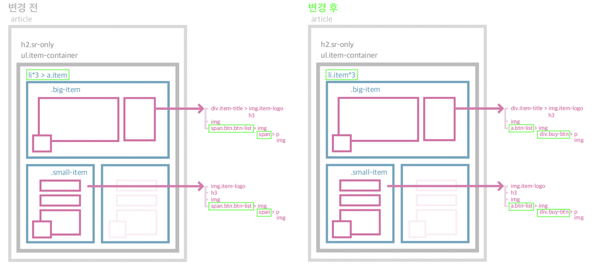

https://juhyuny.github.io/home-work/mission-01/mission01.html 
---


# HTML 마크업 
---
### 구조


### 마크업


1. article 태그를 사용하고 임의의 heading을 추가하여 .sr-only로 숨김 처리.
2. 마우스를 올리고 hover되는 영역이 한 li영역의 전체라는 것을 보여주기 위해 a 태그로 li 내부의 있는 모든 태그를 감쌈.
   
```
    <li><a href="/"></a></li>
```


3. logo 하단의 있는 글을 해당 카드의 헤딩역할로 h3 태그로 마크업.
4. 큰 아이템과 작은아이템의 구조 차이
  - 큰 아이템 : 왼쪽에 배치될 img와 h3를 .item-title로 묶음.

```
    <div class="item-title">
      
      <h3></h3>
    </div>
    
    <span class="btn-list"></span>
```


  - 작은 아이템 

```
    
    <h3></h3>
    
    <span class="btn-list"></span>
```


5. hover 전/후 버튼을 span.btn-list로 묶음.

```
    <span class="btn btn-list">
        
        <span class="buy-btn">
          <p>구매하기</p>
          
        </span>
      </span>
```


# CSS
---
1. 변수 지정

```
    :root {
      --basic-height: 310px;
      --blue-600: #0074E9;
      --gray-100: #f3f3f3;
      --gray-500: #c4c4c4;
      --gray-800: #4e4e4e;
      --white: #ffffff;
      --opacity-20: rgba(0,0,0, .2);
    }
```


2. item들 배치방법


   .item-container에
   - flex 적용
   - 가로 지정
   - 가로값이 넘으면 줄내림이 되도록 flex-wrap:wrap 적용

```
    .item-container {
      width: 502px;
      display: flex;
      flex-flow: row wrap;
      gap: 1rem;
      margin-top: 16px;
    }
```


3. 버튼 리스트(hover 전 이미지와 hover 후 버튼) 가로로 나열 후 위치 지정

```
    /* 버튼 리스트(.btn-list) 기준점을 item 으로 지정 */
    .item {position:relative;}

    /* 버튼 리스트의 위치 지정 */
    .btn-list {
      display: flex;
      position: absolute;
      left: 20px;
      bottom: 20px; 
    }
```

4. hover 전 버튼과 hover 후 버튼이 겹치도록 위치 조정

```
    .buy-btn {
      display: none;
      justify-content: space-between;
      align-items: center;
      gap: 16px;
      width: 112px;
      height: 42px;
      padding: 12px 18px 13px 20px;
      background-color: var(--blue-600);
      color: #fff;
      font-size: 0.875rem;

      /* margin 마이너스 값으로 버튼만큼 위치 당기기 */
      margin-left: -42px;

    }
```

5. item을 hover, focus 됐을 때 적용되는 style

```
    /* 아이템의 border 변화 */
    .item:hover {
      border: 1px solid var(--blue-600);
    }

    /* 구매하기 버튼 보이기 */
   /* li.a에 focus 될 때도 구매하기 버튼 보이기 */
    .item:hover .buy-btn, .item:focus .buy-btn {
     display: flex;
   }
```


# 문제 및 수정
---
#### 접근성 문제
  문제 : a 태그로 모두를 감싼 상황일 경우, 화면을 tab으로 접근하면 스크린리더로 읽힐 때 안에 있는 모든 요소들이 읽혀버림.
  - 수정 : focus되면서 접근되어야할 요소는 '구매하기'버튼이기 때문에 불필요한 a 태그를 지우고 '구매하기' 버튼을 감싸도록 마크업.
  
  
#### 마크업 문법오류 
  - 문제 : span 태그의 자식으로 p 태그가 들어갈 수 없음.
          <span> 
          Phrasing Content(구문 콘텐츠)인 <span> 태그는 텍스트와 텍스트가 포함된 마크업을 정의하는 컨텐츠. inline 요소.
          <p> 
          Flow Content(플로우 컨텐츠). block 요소
          
  - 수정 : 자식 요소 span 태그는 div태그로 바꾸고, 감싸는 span 태그는 hover 전 버튼과 hover 후 구매하기 버튼이므로 focusable 요소인 a 태그로 바꿈. 
  

#### hover 변경요소 선택 시 CSS 한계
  - 문제
    1. 구매하기 버튼에 호버하면 구매하기 버튼이 보이면서 li의 border color가 변경되도록 시도.
    2. CSS에서는 자식을 호버했을 때 부모의 CSS는 변경할 수 없음. 자바스크립트로 구현해야함. 
  - 임시 해결 
    1. li에 호버했을 떄 li의 border가 변경되며 구매하기 버튼 보임.
    2. 링크 이동은 구매하기 버튼을 클릭했을 때만 됨.
  
  
  
### 수정된 HTML 마크업
---



